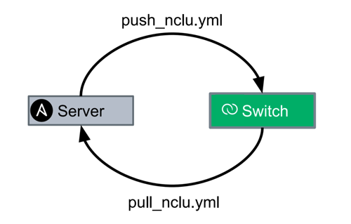

# Cumulus Linux NCLU Module for Ansible
This Git Repo is about Backing up Existing Configurations and replaying them back to your gear with the NCLU module.  Click this link for more info on the [Cumulus Networks NCLU Module](http://docs.ansible.com/ansible/latest/nclu_module.html).



## How To Use

There are two playbooks included in this Git repo.  You can choose to just copy the code down or do a git clone to your local machine (preferred)

```
git clone https://github.com/seanx820/ansible_nclu
```

To run the playbook you use the ansible_playbook command.  The two playbooks will be run like this:

```
ansible-playbook pull_nclu.yml
```

The pull_nclu.yml playbook will create two folders.  One called save_nclu/<hostname>_nclu where it is a single flat file per host in your Ansible setup with all the net commands required to rebuild the config. There will also be rendered config (what the config will actually look like if you cat the flat-files (e.g. `/etc/network/interfaces` or `/etc/quagga/Quagga.conf`).  The rendered config will be stored under config_files/<hostname>.

```
ansible-playbook push_nclu.yml
```

The push_nclu.yml commands simply replays the net commands back to the switch.  The playbook will look in the save_nclu directory for the corresponding host and play each net command back to the host line by line.  The Cumulus Linux NCLU Ansible module is idempotent so each task will return "GREEN" OK if the net command is already configured.


## Background Info

Prior to the Cumulus Networks NCLU Module for Ansible I wrote this Knowledge Base article on backup and restoring configs on Cumulus Linux here: [https://support.cumulusnetworks.com/hc/en-us/articles/209620358-Ansible-Backing-up-Existing-Configurations](https://support.cumulusnetworks.com/hc/en-us/articles/209620358-Ansible-Backing-up-Existing-Configurations).  This way will still work but for those who want to use the NCLU module and net command soley and not keep track of which files they are touching this gives an alternate method.
